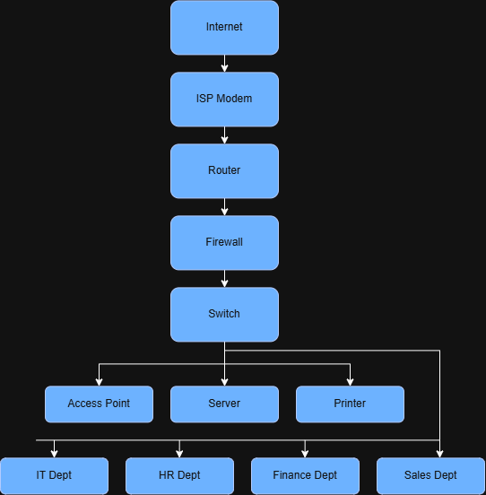

# Week 2 – Enterprise Infrastructure Planning for a Startup Company

**Course:** ITEP 414 – System Administration and Maintenance
**Student:** Ma. Viezel R. Manzano
**Project Type:** Individual Portfolio Project

## Project Overview

This project simulates the role of a Junior System Administrator tasked with
designing the complete IT infrastructure plan for **ABC Startup Solutions**, a
newly established 20-employee software development company with no existing
computers, servers, network, or security policies. The plan covers company
profiling, hardware/software/network inventories, a network topology diagram,
research into System Administration roles, infrastructure recommendations, and
a personal reflection.

## Learning Objectives

- Explain the roles and responsibilities of a System Administrator
- Identify the hardware, software, and networking requirements of a small business
- Describe the purpose of IT documentation and infrastructure planning
- Analyze organizational IT requirements and prepare professional IT inventories
- Design an enterprise network topology
- Create technical documentation using Markdown
- Present infrastructure planning professionally

## Company Scenario

**ABC Startup Solutions** is a newly established software development company
with 20 employees across four departments:

| Department | Employees |
|---|---|
| Information Technology | 5 |
| Human Resources | 4 |
| Finance | 5 |
| Sales | 6 |
| **TOTAL** | **20** |

The company starts with no computers, no server, no network, no internet
infrastructure, and no security policies — everything is designed from scratch.

## Hardware Inventory Summary

12 desktop computers, 8 laptops, 1 server, 1 router, 2 managed switches,
2 network printers, 3 UPS units, 2 wireless access points, 1 NAS storage unit,
2 external backup drives, and 18 monitors. Full details, quantities, and
justifications are in [`EnterpriseInfrastructurePlan.pdf`](./EnterpriseInfrastructurePlan.pdf).

## Software Inventory Summary

Windows 11 Pro, Ubuntu Server, Microsoft 365, VS Code, Git, GitHub Desktop,
VirtualBox, Google Chrome, Microsoft Defender, AnyDesk, and 7-Zip — covering
operating systems, productivity, development, and security needs. Full
version/license/purpose breakdown is in the PDF report.

## Embedded Network Diagram



*(Diagram built in draw.io — see `diagrams/Diagram.png` and
`diagrams/Diagram.pdf`.)*

## Technologies Used

- **draw.io** – network topology diagramming
- **Markdown** – documentation
- **Microsoft Word / PDF** – final infrastructure plan report
- **GitHub** – version control and portfolio hosting

## Challenges Encountered

The most challenging part was keeping the network diagram consistent with the
hardware and network inventory tables — every device listed in the inventory
had to be logically represented and correctly connected in the diagram.

## Reflection

See **Part 8: Personal Reflection** in
[`EnterpriseInfrastructurePlan.pdf`](./EnterpriseInfrastructurePlan.pdf) for a
full discussion of what was learned, the most challenging task, why planning
matters before deployment, and how this project supports growth as a future
System Administrator.

## References

- Course module: *ITEP 414 – System Administration and Maintenance, Week 2
  Portfolio Project*, prepared by John Randolf M. Penaredondo, MIT — LSPU
  Self-Paced Learning Module.

## Repository Structure

```
BSIT-SystemAdministration-Portfolio/
└── Week02/
    ├── EnterpriseInfrastructurePlan.pdf
    ├── README.md
    ├── diagrams/
    │   ├── network-topology.png
    │   └── network-topology.pdf
    ├── images/
    └── references/
```

